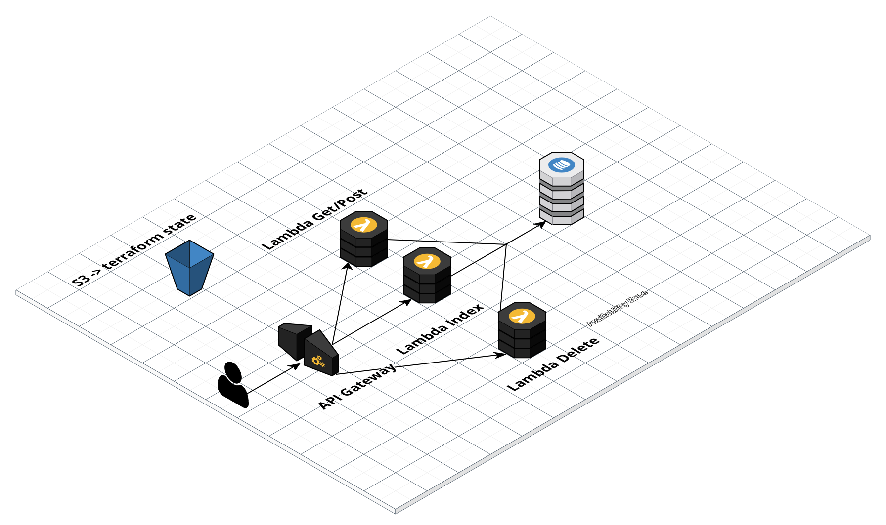
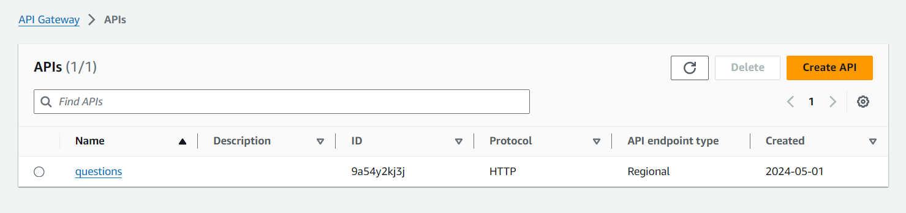
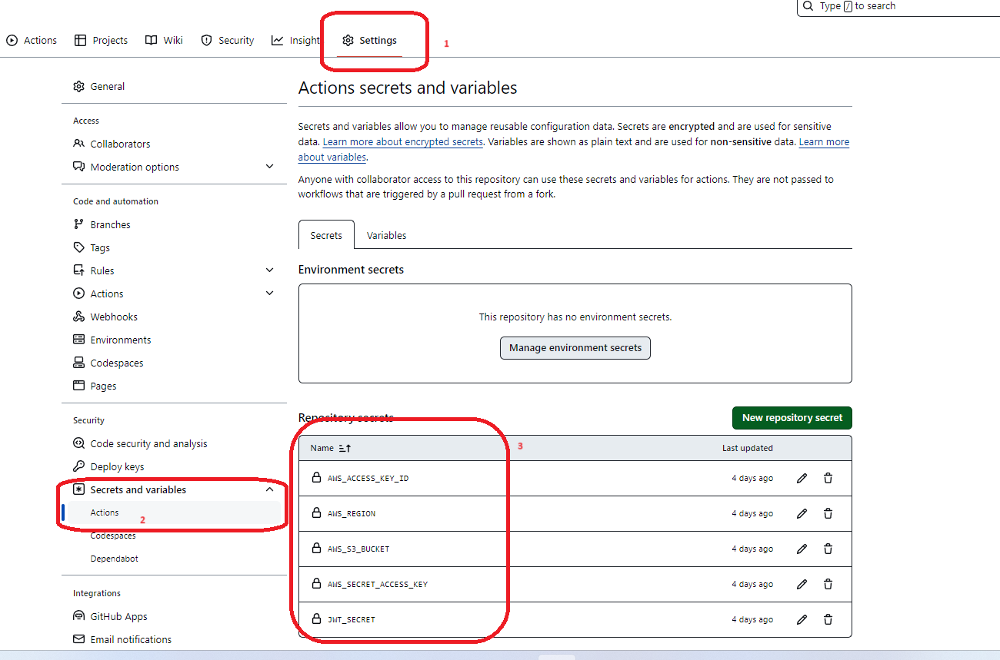
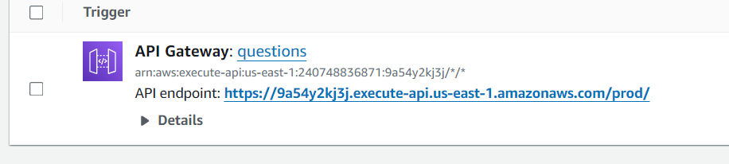

# Projeto - Curso de Cloud AWS

 -[Projeto - Curso de Cloud AWS](#projeto---curso-de-cloud-aws)
    -[Projeto](#projeto)
    -[Flowchart](#flowchart)
    -[Referências](#referências)
    -[Autora](#autora)

## Projeto

O gerente da empresa que você trabalha precisa subir relatórios, ele te chamou para ajudá-lo com uma nova automação que possa incluir esses arquivos garantindo resiliência, segurança e alta disponibilidade. Você como arquiteto/a de soluções o convence a usar AWS.

O objetivo é mostrar a solução funcionando na reunião do final de módulo e apresentar ao gerente (vulgo seu instrutor) para alcançar sua promoção.

Obs: os relatórios podem ser fictícios - podendo usar qualquer tipo de arquivo
Plus: Incluir o desenho da arquitetura planejada utilizando draw.io 

## Flowchart



## Detalhamento

 1. O projeto consiste em um gitAction para subir a infra usando terraform, uma interface simples para ter a interatividade com a API e gerar dados.
 2. Após realizar o commit na main será subido ou atualizado a infraestrutura permitindo acessar um link gerado pelo API Gateway 



 3. A interface contém um input que fará a requisição de GET/POST/DELETE utilizando a liguagem Node.js 
 4. Essa requisição irá fazer a alteração no DynamoDB.
 5. Apesar de não ter no Terraform, para completar os prérequisitos do projeto adicionei um EventBridge(Programado) para que a cada 7 dias rode uma Lambda para fazer uma busca do banco de dados usando a linguagem Python e a biblioteca Boto3 para pegar os dados.

## Como rodar o projeto

Clonar o repositório:
```bash
git clone https://github.com/DeBaFig/ProjetoFinalAda.git 
```

Fazer um novo repositório novo e adicionar algumas chaves de segredo:



`AWS_ACCESS_KEY_ID` 
`AWS_SECRET_ACCESS_KEY`  
`AWS_REGION`  
`AWS_S3_BUCKET`  #vai guardar o terraform state
`JWT_SECRET` #eu usei jwt-secret-1234

permissões necessárias:
`AmazonAPIGatewayAdministrator`  
`AWSLambda_FullAccess`  
`IAMFullAccess`  
`CloudWatchLogsFullAccess`  
`AmazonS3FullAccess`  
`AmazonDynamoDBFullAccess`

trocar o nome do bucket, o meu está como:
`bck-projto-cloud-denize`

O projeto também está para region us-east-1 no main.tf você pode trocar caso necessário (e no segredo também)

por fim commitar na main (caso tenha clonado será necessário também apagar a pasta git com o comando rm -rf .git)
```
git init
git add .
git commit -m "Primeiro Commit"
```

Terraform vai provisionar a infraestrutura e você vai poder ver funcionando a interface indo no API Gateway e pegando o link de prod



**O link será diferente da imagem, procure ou no lambda ou direto no API Gateway


## Referências

[Instrutora - Talita](https://www.linkedin.com/in/talits/)
[Código Exemplo](https://www.youtube.com/watch?v=Ow0yM4Ebh6k&t=252s)


## Autora

**Denize**

It is not luck, it is hard work!


Where to find me:


[](https://twitter.com/Dbassi91)   
[](https://www.linkedin.com/in/dbfigueiredo/)   
[](mailto:denize.f.bassi@gmail.com)   
[](https://codepen.io/debafig)   
[](https://www.facebook.com/d.bassi91/)   
[](https://github.com/DeBaFig)   
[](https://www.instagram.com/bassidenize/)   
[](https://debafig.github.io/me/)   
[](https://whatsa.me/5547935051914)
[](https://discordapp.com/users/DeBaFig#5875)
